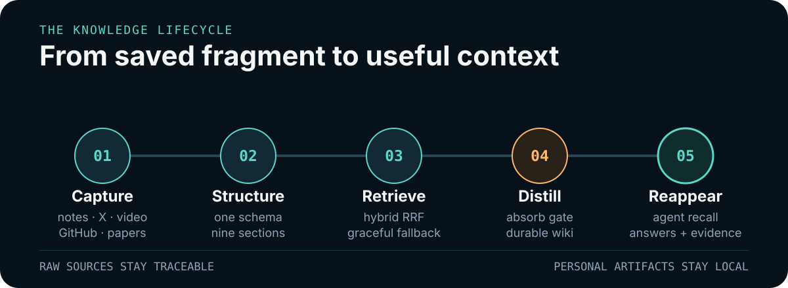

<p align="right">
  <strong>English</strong> · <a href="./README.zh.md">繁體中文</a>
</p>

<p align="center">
  
</p>

<p align="center">
  <a href="#quick-start"><strong>Quick start</strong></a> ·
  <a href="#how-it-works"><strong>How it works</strong></a> ·
  <a href="#choose-your-runtime"><strong>Runtime modes</strong></a> ·
  <a href="./docs/data-flow.md"><strong>Privacy & data flow</strong></a> ·
  <a href="#license"><strong>License</strong></a> ·
  <a href="https://youtu.be/JWgm6ky_pys"><strong>Pitch video</strong></a>
</p>

<p align="center">
  <a href="./LICENSE"></a>
</p>

## Knowledge should not disappear after capture

Bookmarks, notes, videos, repositories, papers, and conversations accumulate quickly. Most knowledge tools help you save them; the difficult part comes later: recovering the right idea, with evidence, while you are actually working.

**X Knowledge Base (XKB)** is a local-first knowledge lifecycle for people and AI agents. It converts heterogeneous sources into one structured card format, retrieves them through hybrid search, distills durable insights into a human-readable wiki, and surfaces relevant context during a conversation.

This repository contains the reusable tooling. Your cards, indexes, wiki pages, graph data, credentials, and runtime state stay in your own workspace and are excluded from the public repository.

<p align="center">
  
</p>

## What makes XKB different

### One schema across many sources

Local Markdown, X/Twitter bookmarks, YouTube transcripts, GitHub repositories, PDFs, and PubMed papers converge on the same nine-section core card schema. That gives retrieval and synthesis a stable unit instead of a pile of source-specific summaries.

### Retrieval before generation

XKB searches the distilled wiki first, then the underlying evidence cards. In Full mode, XBrain/GBrain provides vector + keyword hybrid retrieval with Reciprocal Rank Fusion (RRF). If that runtime is unavailable, XKB falls back to local keyword and flat vector indexes.

### Distillation is gated

Cards are evidence units; wiki topics are durable understanding. `sync_cards_to_wiki.py` and `distill_memory_to_wiki.py` use an absorb/staging workflow so every captured item does not automatically become long-term knowledge.

### Built for agent conversations

`recall_for_conversation.py`, `xkb_ask.py`, and the MCP server expose relevant knowledge with source links. The goal is not another archive to browse—it is context that returns when an agent or person needs it.

## Quick start

The smallest useful path ingests local Markdown and searches it. It does **not** require X/Twitter cookies, Bun, GBrain, Postgres, or an OpenClaw cron setup.

### 1. Clone and create a private workspace

```bash
git clone https://github.com/Hidicence/x-knowledge-base.git
cd x-knowledge-base

export OPENCLAW_WORKSPACE="$HOME/.openclaw/workspace"
mkdir -p \
  "$OPENCLAW_WORKSPACE/memory/cards" \
  "$OPENCLAW_WORKSPACE/memory/bookmarks"
```

Record where your data lives. The scripts locate their own code from their file
location, so the only thing they need told is the data directory:

```bash
python3 scripts/xkb_init.py                  # prompts, defaults to the path above
python3 scripts/xkb_init.py --show           # show what is currently resolved
```

This writes `.xkb.json` next to the scripts. It is machine-local and gitignored —
your clone can sit anywhere, and the data can sit somewhere else entirely.
Environment variables (`XKB_DATA_DIR`, `OPENCLAW_WORKSPACE`) still override it.

### 2. Configure an LLM

If you already use OpenClaw, select any model available to your OpenClaw installation in `config/llm.json`.

For standalone use, export an OpenAI-compatible endpoint:

```bash
export LLM_API_URL="https://your-provider.example/v1"
export LLM_API_KEY="your-key"
export LLM_MODEL="your-model"
```

> Do not commit real credentials. Environment variables and your private OpenClaw configuration are runtime state, not repository content.

### 3. Ingest, index, and ask

```bash
# Replace demo/sample-notes with your own Markdown directory.
python3 scripts/local_ingest.py demo/sample-notes \
  --category learning --limit 3

bash scripts/build_search_index.sh
bash scripts/search_bookmarks.sh "agent memory"
python3 scripts/xkb_ask.py "What patterns appear across these notes?"
```

Generated cards and indexes are written under `$OPENCLAW_WORKSPACE/memory/`, not into this repository.

## How it works

```text
Sources
  local notes · X bookmarks · YouTube · GitHub · PDF/PubMed · memory
       │
       ▼
Shared card contract
  source adapters + scripts/_card_prompt.py + scripts/_llm.py
       │
       ▼
Knowledge cards
  one nine-section schema · source links · claim level · bilingual summary
       │
       ├──────────────► XBrain/GBrain hybrid retrieval (primary)
       │                    vector + keyword + RRF
       │
       ├──────────────► search_index.json / vector_index.json (fallback)
       │
       ▼
Absorb gate
  cards + conversation memory → staging/review → durable wiki topics
       │
       ▼
Active recall
  wiki first → evidence cards → answer with sources
```

### The nine-section card

Every supported source produces the same knowledge structure:

1. Core question and conclusion
2. Claim level: Attested, Scholarship, or Inference
3. Key arguments
4. False Friends—terms whose technical meaning differs from common usage
5. Surprises
6. Relationship to existing knowledge
7. Bilingual summary for retrieval
8. Actionable value
9. Original source and links

For image-bearing sources, XKB can append a tenth **Media Evidence** section with OCR and vision notes through `scripts/media_ingest.py`.

## Choose your runtime

Start with the smallest mode that solves your problem.

| Mode | Best for | Retrieval | Additional runtime |
| --- | --- | --- | --- |
| **Lite** | First use, local notes, small libraries | `search_index.json` keyword search | Python + an LLM |
| **Enhanced** | Semantic fallback without a database service | flat `vector_index.json` | Gemini, OpenAI, or local Ollama embeddings |
| **Full / XBrain** | Larger libraries and agent workflows | vector + keyword hybrid RRF | OpenClaw + GBrain/XBrain |

### Enable flat semantic retrieval

```bash
export EMBEDDING_PROVIDER=gemini
export GEMINI_API_KEY="your-key"
python3 scripts/build_vector_index.py --incremental
```

`build_vector_index.py` also supports the embedding providers documented in `.env.example`; use Ollama when you want embeddings to remain local.

### Enable XBrain/GBrain

Review `scripts/setup_xbrain.sh` before running it: the script installs or updates Bun/GBrain and edits your local OpenClaw configuration.

```bash
bash scripts/setup_xbrain.sh
python3 scripts/health_check_pipeline.py
```

When XBrain is available, ingest scripts make a best-effort attempt to index newly written cards and recall can use `xbrain_recall.py`. Local card creation remains independent; if XBrain cannot be reached, recall degrades to local indexes.

## Add sources

```bash
# Local Markdown / text
python3 scripts/local_ingest.py /path/to/notes --category learning

# X/Twitter bookmarks already saved in your workspace
python3 scripts/run_scan_worker.py --limit 20

# YouTube playlist transcripts
python3 scripts/fetch_youtube_playlist.py --playlist "PLAYLIST_URL" --limit 5

# GitHub forks and stars
python3 scripts/fetch_github_repos.py --forks --stars --limit 20

# PubMed open-access papers
python3 scripts/fetch_pubmed.py "retrieval augmented generation" \
  --limit 10 --out /tmp/xkb-papers
python3 scripts/local_ingest.py /tmp/xkb-papers --category research --tag pubmed
```

Source adapters converge on the shared card contract. Most use `_card_prompt.py` directly; local-file ingest currently maintains a compatible prompt implementation while producing the same core schema.

## Distill cards into durable knowledge

The wiki is a curated output layer, not a mirror of every captured item.

```bash
# Evaluate cards through the absorb gate and update wiki topics.
python3 scripts/sync_cards_to_wiki.py --apply --limit 20

# Extract durable candidates from recent conversation memory.
python3 scripts/distill_memory_to_wiki.py --stage --days 3

# Inspect the staged file before applying selected candidates.
python3 scripts/distill_memory_to_wiki.py --apply \
  --staging-file "$OPENCLAW_WORKSPACE/memory/x-knowledge-base/wiki/_staging/FILE.md" \
  --approve-all
```

The default runtime layout is documented in [`docs/RUNTIME_PATHS.md`](./docs/RUNTIME_PATHS.md).

## Ask and recall

```bash
# Grounded question answering over wiki topics and evidence cards
python3 scripts/xkb_ask.py "What alternatives to RAG have I collected?"

# Compact output for chat workflows
python3 scripts/xkb_ask.py "What is the absorb gate?" --format chat

# Conversation-time retrieval
python3 scripts/recall_for_conversation.py \
  "I need a reliable agent memory workflow" --json
```

### MCP tool

Expose recall to Claude Code or another MCP client:

```json
{
  "mcpServers": {
    "xkb-recall": {
      "command": "python3",
      "args": ["/absolute/path/to/x-knowledge-base/scripts/xkb_recall_server.py"],
      "env": {
        "OPENCLAW_WORKSPACE": "/absolute/path/to/your/workspace"
      }
    }
  }
}
```

## Explore the knowledge graph

The demo is a Next.js three-panel explorer: **Knowledge Graph · Chat · Evidence**.

```bash
python3 demo/generate_graph.py
cd demo/xkb-demo-ui
npm install
npm run dev
# http://localhost:3000
```

Generated graph data is stored in the private workspace. The repository only includes a sanitized schema/sample.

## Privacy model

XKB is local-first, not automatically local-only. Generated artifacts stay local, but cloud-backed enrichment and embeddings send selected content to configured services.

- Knowledge cards, indexes, wiki topics, graph data, and queues remain in your workspace.
- Local documents and fetched source text are sent to your configured LLM when enrichment runs.
- Card titles and summaries are sent to the selected embedding provider when vector indexing runs.
- X/Twitter session cookies are high-sensitivity credentials and must never enter source control.
- Ollama can keep embedding generation local; skipping cloud enrichment keeps raw capture local as well.

Read [`docs/data-flow.md`](./docs/data-flow.md) before ingesting sensitive material. It maps each source and script to the third parties it may contact.

## Repository and runtime boundaries

```text
x-knowledge-base/                         reusable code, docs, templates
$OPENCLAW_WORKSPACE/memory/cards/         generated knowledge cards
$OPENCLAW_WORKSPACE/memory/bookmarks/     raw sources + fallback indexes
$OPENCLAW_WORKSPACE/memory/x-knowledge-base/wiki/
                                          staging + distilled wiki topics
```

Never commit `.env`, session cookies, API keys, generated personal cards, indexes, wiki pages, queues, logs, or machine-specific paths.

## Operate and verify

```bash
# Pipeline health and canonical wiki paths
python3 scripts/health_check_pipeline.py

# Index quality
python3 scripts/audit_index_quality.py
python3 scripts/prune_duplicate_index_rows.py --dry-run

# Wiki structure
python3 scripts/lint_wiki.py

# Before publishing repository changes
git diff --check
python3 scripts/health_check_pipeline.py
```

## Project map

| Area | Key files |
| --- | --- |
| Card contract & LLM | `scripts/_card_prompt.py`, `scripts/_llm.py`, `scripts/local_ingest.py` |
| Source adapters | `local_ingest.py`, `fetch_youtube_playlist.py`, `fetch_github_repos.py`, `fetch_pubmed.py` |
| Retrieval | `xbrain_recall.py`, `build_search_index.sh`, `build_vector_index.py` |
| Active recall | `xkb_ask.py`, `recall_for_conversation.py`, `xkb_recall_server.py` |
| Distillation | `sync_cards_to_wiki.py`, `distill_memory_to_wiki.py` |
| Operations | `health_check_pipeline.py`, `status_knowledge_pipeline.py`, `lint_wiki.py` |
| Demo | `demo/generate_graph.py`, `demo/xkb-demo-ui/` |

## Design principles

- **Understanding over storage.** A card should answer what a source helps you understand, not merely summarize it.
- **One schema, many sources.** Stable knowledge units make cross-source retrieval possible.
- **Evidence before synthesis.** Durable conclusions remain traceable to cards and original URLs.
- **Gates over automatic accumulation.** The wiki earns its signal by rejecting low-value material.
- **Graceful degradation.** Full hybrid retrieval is optional; the library remains usable without it.
- **Personal data stays personal.** Reusable tooling belongs in git; runtime knowledge does not.

## Contributing

Start with [`SKILL.md`](./SKILL.md), [`docs/data-flow.md`](./docs/data-flow.md), and [`docs/xkb-wiki-architecture.md`](./docs/xkb-wiki-architecture.md). Issues and pull requests are welcome.

## License

XKB is **source-available for noncommercial use** under the [PolyForm Noncommercial License 1.0.0](./LICENSE). Personal research, study, experimentation, hobby projects, and qualifying noncommercial-organization use are permitted under its terms. Commercial use is not granted by this license and requires a separate written license from the licensor.

This is **not an OSI-approved open-source license**. Review the full license before using, modifying, or distributing XKB.

Required Notice: Copyright 2026 Hidicence. Licensed under the PolyForm Noncommercial License 1.0.0.

Your knowledge deserves more than storage. It deserves to return when it matters.
