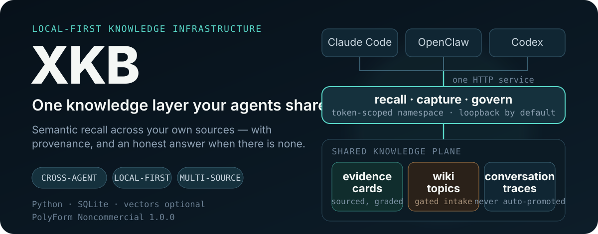

<p align="right">
  <strong>English</strong> · <a href="./README.zh.md">繁體中文</a>
</p>

<p align="center">
  
</p>

<p align="center">
  <a href="#quick-start"><strong>Quick start</strong></a> ·
  <a href="#connect-an-agent"><strong>Connect an agent</strong></a> ·
  <a href="#how-recall-decides"><strong>How recall decides</strong></a> ·
  <a href="./docs/xkb-memory-service.md"><strong>Service API</strong></a> ·
  <a href="./docs/data-flow.md"><strong>Privacy</strong></a> ·
  <a href="https://youtu.be/JWgm6ky_pys"><strong>Pitch video</strong></a>
</p>

<p align="center">
  <a href="./LICENSE"></a>
  
  
</p>

## Every agent starts cold

You run more than one coding agent. Each opens with no idea what you decided last week, which approach already failed, or what you have been reading for six months. So you re-explain, and they re-derive.

**XKB is one knowledge layer they share.** It turns your sources into evidence cards with traceable provenance, distils durable conclusions into a wiki, and serves all of it back through a single local-first API — so Claude Code, OpenClaw and Codex are reading the same memory instead of each keeping their own.

---

## What a recall actually returns

```console
$ curl -s localhost:18972/v1/recall -H "Authorization: Bearer $TOKEN" \
       -H 'Content-Type: application/json' --data-binary @query.json
```

```jsonc
{
  "retrieval_mode": "xbrain_hybrid",       // it really ran vector search
  "count": 5,
  "dropped_as_irrelevant": 5,              // and threw away half as not relevant
  "records": [
    { "record_type": "knowledge_chunk",
      "score": 0.604,                      // measured cosine, not a rank score
      "rank_score": 0.888,                 // what the backend ranked on
      "source_url": "https://…" }
  ],
  "filtered_counts": { "total": 0, "by_layer": { "card": 0, "wiki": 0 } },
  "warnings": ["5 semantic results dropped below the relevance floor"]
}
```

Ask it something your library has nothing on and it says so, instead of returning the ten least-bad rows:

```jsonc
{ "count": 0, "retrieval_mode": "keyword_fallback",
  "warnings": ["semantic results found but 10 dropped below the relevance floor"] }
```

That distinction is the point. A silent empty result and a broken retrieval backend look identical, and telling them apart after the fact is very hard.

---

## Why the results are different

### Relevance is measured, not assumed

Hybrid search returns a **rank** score: it says *this came first*, not *this is relevant*. On a real library, the top hit sits near `0.88` whether or not anything on the subject exists — measured here, an off-topic question scored `0.863` against an on-topic one at `0.862`. XKB recomputes the true query/document cosine and drops whatever falls below the floor, so an unrelated question returns nothing and costs nothing.

### Every claim keeps its receipt

Sources become a nine-section card carrying its origin URL and a **claim level** — `Attested`, `Scholarship`, or `Inference`. When a card comes back six months later you can see what kind of statement it was and who made it.

### Distillation is gated, in both directions

Cards are evidence; wiki topics are understanding. Nothing crosses that line automatically: an absorb gate scores topical fit and redundancy, and it **fails closed** — if the gate cannot run, nothing is absorbed. Conversations captured from agents become *candidates*, never knowledge, until they clear review.

### Knowledge is allowed to age out

Retrieval records whether each item, once surfaced, was ever relevant enough to use. Anything repeatedly retrieved that never clears the floor is reported as a retirement candidate — reported only. Provenance is the product; nothing is deleted to keep things tidy.

---

## Quick start

The smallest useful path ingests local Markdown and searches it. No X cookies, no Postgres, no cron.

**1 · Clone and create a private workspace**

```bash
git clone https://github.com/Hidicence/x-knowledge-base.git
cd x-knowledge-base
python3 scripts/xkb_init.py          # writes .xkb.json, gitignored
```

**2 · Point it at a model**

```bash
export LLM_API_URL="https://your-provider.example/v1"
export LLM_API_KEY="your-key"
export LLM_MODEL="your-model"
```

> Credentials are runtime state, never repository content. XKB is provider-agnostic; local models work.

**3 · Ingest, index, ask**

```bash
python3 scripts/local_ingest.py demo/sample-notes --category learning --limit 3
bash    scripts/build_search_index.sh
python3 scripts/xkb_ask.py "What patterns appear across these notes?"
```

Cards and indexes are written to your workspace, never into this repository.

---

## Connect an agent

Start the service, then install the hook. Recall and capture become automatic — the agent is not trusted to remember to call anything.

```bash
python3 scripts/xkb_knowledge_service.py          # 127.0.0.1:18972
python3 scripts/xkb_install_agent_hook.py --install
```

```text
UserPromptSubmit  →  turns/start     →  recalled knowledge injected as context
Stop              →  turns/complete  →  the exchange becomes L1 evidence
```

Install is idempotent, leaves your other hooks alone, and writes settings atomically. `--uninstall` removes exactly what it added.

**Reading fails open.** If the service is unreachable the hook injects nothing and exits quietly; it never blocks a conversation. That is the deliberate mirror of the absorb gate, where failure must block — writing bad knowledge is worse than writing none.

### From another machine

The service binds loopback and refuses to start on a public interface without tokens. To reach it from a laptop, tunnel rather than expose:

```bash
ssh -N -L 18972:127.0.0.1:18972 your-server
```

Identity comes from a bearer token that pins a namespace and scopes; a request claiming a different namespace is refused, not quietly retargeted. With no token configured the service stays anonymous, which is the single-user default.

---

## How recall decides

```text
message
   │
   ├─ acknowledgement or greeting ────────────────► skip entirely, no embedding call
   │
   ▼
semantic search  ──►  measured cosine  ──►  below floor?  ──► dropped
   │                                                              │
   ▼                                                              ▼
wiki topics · evidence cards · conversation traces      nothing, and it says why
   │
   ▼
ACL by namespace (fail-closed)  ──►  context, with sources
```

Every response reports `retrieval_mode`, which layers the ACL filtered, and how much was dropped as irrelevant — so a thin result is always explainable rather than mysterious.

---

## Sources

One card contract, many inputs:

```bash
python3 scripts/local_ingest.py ~/notes --category research    # Markdown / text
python3 scripts/pdf_ingest.py paper.pdf                        # PDF / papers
python3 scripts/fetch_youtube_playlist.py <playlist-url>       # transcripts
python3 scripts/fetch_github_repos.py                          # stars and forks
python3 scripts/media_ingest.py <file.md> --limit 4            # image OCR + vision
```

X/Twitter bookmark import, PubMed, and a Minions-backed enrichment queue are included; see [`SKILL.md`](./SKILL.md).

---

## Runtimes

Start with the smallest mode that solves your problem.

| Mode | Retrieval | Needs |
| --- | --- | --- |
| **Lite** | keyword over `search_index.json` | Python + an LLM |
| **Enhanced** | flat vector index, semantic recall | an embeddings provider (Gemini, OpenAI, or local Ollama) |
| **Full** | XBrain/GBrain hybrid + RRF | Postgres + pgvector |

Recall degrades in that order and always tells you which one ran.

---

## What this is not

Being explicit is cheaper than disappointment:

- **Not a hosted product.** It runs on your machine, against your files.
- **Not automatic.** Nothing is promoted into wiki, and nothing is retired from it, without you.
- **Not an agent framework.** It stores and returns knowledge; your agent does the thinking.
- **Early.** The service, the cross-agent hooks, and the retirement signal are new. Interfaces will move.

Cloud embeddings mean queries leave your machine; set `EMBEDDING_PROVIDER=ollama` to keep everything local. See [`docs/data-flow.md`](./docs/data-flow.md) for exactly what is sent where.

---

## Documentation

| Document | Contents |
| --- | --- |
| [`docs/xkb-memory-service.md`](./docs/xkb-memory-service.md) | Service API, auth, agent hooks, relevance floor |
| [`docs/data-flow.md`](./docs/data-flow.md) | What leaves your machine, and how to stop it |
| [`docs/RUNTIME_PATHS.md`](./docs/RUNTIME_PATHS.md) | Where code ends and your data begins |
| [`SKILL.md`](./SKILL.md) | Full command surface |
| [`wiki/WIKI-SCHEMA.md`](./wiki/WIKI-SCHEMA.md) | Wiki topic contract |

## License

[PolyForm Noncommercial 1.0.0](./LICENSE) — free for noncommercial use.
