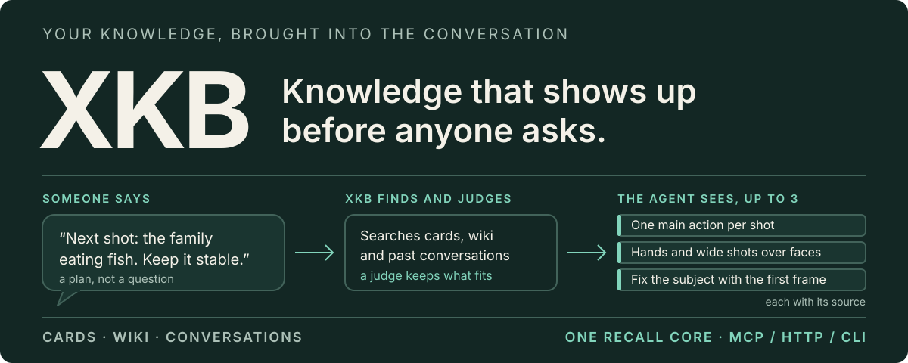

<p align="right">
  <strong>English</strong> · <a href="./README.zh.md">繁體中文</a>
</p>

<p align="center">
  
</p>

# XKB · Knowledge your agents can return to

**Turn saved sources into a searchable knowledge base, and let your AI agents retrieve the evidence from it.**

XKB keeps source-linked Markdown cards, wiki topics and captured conversation traces under your control. MCP, HTTP and the default CLI clients use one recall core, so connected agents can search the same library with the same access rules and relevance checks.

[Try it](#try-it-without-api-keys) · [Use your own sources](#build-your-library) · [Connect an agent](#connect-your-agents) · [How recall works](#how-recall-works)

## Keep the evidence, including disagreement

In the bundled synthetic library, asking **“Aurora deployment”** returns both recorded approaches:

| Evidence | What it says |
| --- | --- |
| `aurora-blue` | Use blue-green releases. |
| `aurora-canary` | Use canary releases instead of blue-green. |

These are fixture records, not a production benchmark. The example shows what recall is for: return the relevant sources, preserve their differences, and let the answering agent reason from them. A record's source, document section and namespace remain available in the response.

The [unchanged 24-case offline suite](./evals/recall-cases.json) now passes [24/24](./evals/recall-keyword-report.json). It covers keyword recall, Chinese queries, conflicting evidence, access boundaries, no-answer queries and the real MCP transport. It does **not** measure semantic-model or generated-answer quality.

## Try it without API keys

Requires **Python 3.10+** and Git. The offline example works on Windows too (`python` can replace `python3`). The ingestion workflow below also needs Bash; use Linux, macOS or WSL for that path.

```bash
git clone https://github.com/Hidicence/x-knowledge-base.git
cd x-knowledge-base
python3 scripts/xkb_eval.py
```

This creates a temporary fixture library, starts real MCP subprocesses, runs the labelled queries and prints a JSON report. It uses no provider credentials and does not read your personal library.

## Build your library

Create a data directory outside the checkout. `xkb_init.py` records its location; it does not create the directory for you.

```bash
export XKB_DATA_DIR="$HOME/xkb-data"
mkdir -p "$XKB_DATA_DIR/cards" "$XKB_DATA_DIR/bookmarks" \
         "$XKB_DATA_DIR/x-knowledge-base/wiki/topics"
python3 scripts/xkb_init.py --data-dir "$XKB_DATA_DIR"
```

Configure a chat-completions provider to generate cards. These commands send the selected notes to that provider and may incur costs. Use your own provider's URL, key and model name.

```bash
export LLM_API_URL="https://your-provider.example/v1"
export LLM_API_KEY="your-key"
export LLM_MODEL="your-model"

python3 scripts/local_ingest.py demo/sample-notes --category learning --limit 3
python3 scripts/recall_router.py "agent memory" --json
```

Local ingestion writes both cards and the search index; a separate index rebuild is unnecessary here. Its exit code is `2` when new cards were added, `0` when none were added. That is a change signal, not a failure.

Keyword recall works without embeddings. Enable semantic retrieval using the [embedding configuration guide](./docs/embedding-configuration.md). Jev relevance judging is optional and requires a provider that also serves `/systemone`; a chat-completions endpoint alone is insufficient. An unavailable judge is reported and retains candidates. Set `XKB_JEV_DECIDE=0` to disable it deliberately.

To generate an answer from the recalled evidence:

```bash
python3 scripts/xkb_ask.py "What is the difference between RAG and agent memory?"
```

The answer requires the configured chat model. `--json` includes the recall packet and available evidence references; it does not prove the model used every reference. The current answer prompt is tailored to Traditional Chinese.

## Connect your agents

**MCP provides recall. Conversation capture needs a separate hook or HTTP integration.** Connecting an MCP tool does not automatically record every conversation.

For an MCP client such as Codex or Claude Code, register this stdio server, using absolute paths:

```json
{
  "mcpServers": {
    "xkb": {
      "command": "python3",
      "args": ["/absolute/path/x-knowledge-base/scripts/xkb_recall_server.py"],
      "env": {"XKB_ENV_FILE": "/absolute/path/xkb.env"}
    }
  }
}
```

This is the common JSON configuration shape; translate it to your client's configuration format. The tool is `xkb_recall`, with `message` and optional `limit` arguments. Restart or reconnect the client after changing its configuration.

For a local library, the private environment file can contain:

```dotenv
XKB_DATA_DIR=/absolute/path/xkb-data
XKB_SERVICE_DB=/absolute/path/xkb-runtime/knowledge.sqlite
```

To share one deployed library across machines, run `python3 scripts/xkb_knowledge_service.py` on the host holding your data. Point clients at that service instead:

```dotenv
XKB_MEMORY_SERVICE_URL=http://127.0.0.1:18972
XKB_SERVICE_TOKEN=your-service-token
XKB_NAMESPACE=private
```

Keep keys outside the repository. Configure server-side tokens as described in the [service guide](./docs/xkb-memory-service.md); the namespace must match the token. For another machine, use HTTPS or an SSH tunnel, for example `ssh -N -L 18972:127.0.0.1:18972 your-server`.

| Integration | What it provides |
| --- | --- |
| MCP clients | On-demand recall through `xkb_recall`. |
| HTTP clients / OpenClaw integrations | Recall, plus explicit session and turn capture through the service API. |
| Claude Code hook installer | `UserPromptSubmit` recall and `Stop` capture after installation. |

`python3 scripts/xkb_install_agent_hook.py --install` targets **Claude Code settings**. It does not install a Codex/Orca hook. Configure its service connection separately; MCP settings are not hook settings.

Check the actual connection with a topic in your library:

```bash
python3 scripts/xkb_doctor.py --query "agent memory" --json
```

Doctor verifies MCP initialization, tool discovery and a real call. `ready`, `degraded` and `failed` have different meanings. Add `--require-semantic --require-judge` to require those capabilities. See [recall validation](./docs/recall-validation.md) for full configuration and diagnostics.

## How recall works

1. **Read the allowed sources.** Cards, wiki/daily-note sections and captured conversation traces retain their provenance. Namespace and visibility rules apply before evidence is returned.
2. **Retrieve candidates.** Configured semantic backends search cards and wiki; keyword fallback remains available. Conversation traces use keyword retrieval.
3. **Check relevance.** When configured, Jev judges whether each candidate answers the query. A failed or missing verdict is not counted as rejection.
4. **Merge and rank.** Evidence identity includes namespace and, for documents, section. Different sections remain distinct; duplicate retrieval paths do not inflate usage counts.
5. **Return an inspectable packet.** Records, source references, search mode, per-source status, judge status and warnings travel together through MCP, HTTP and the default CLIs.

Repeated explicit negative verdicts can lower an item's rank. Demotion never deletes the source; one positive verdict lifts it. Returned evidence, judged relevance and use in a final answer are different events.

The older continuity/associative/contrarian/action presentation remains available via `recall_router.py --legacy-router`. It is not the default shared recall path.

## From sources to durable knowledge

XKB also includes ingestion adapters for local notes, X bookmarks, YouTube transcripts, GitHub repositories and papers. They produce a shared nine-section card format with source links, claim levels and summaries; image-bearing sources can add OCR and vision evidence.

Cards can be consolidated into wiki topics through the absorption workflow. Captured conversations can be staged as candidates for review. **Recall itself never promotes a conversation into wiki knowledge.** Run and review these write workflows separately; see the [command guide](./SKILL.md) and [wiki schema](./wiki/WIKI-SCHEMA.md).

## Boundaries worth knowing

- **Local-first describes storage and control.** Cloud card generation, embeddings, relevance judging and answer generation send their respective inputs to configured providers. Selecting local embeddings alone does not make the whole system offline.
- **Fallback is visible.** A missing judge retains candidates and reports degradation. An explicitly configured remote service failure is an error; it never silently switches to a different local library.
- **Quality still needs your labels.** The synthetic suite is a regression check. Judge thresholds and semantic retrieval need evaluation on independently reviewed examples from your own library.
- **This is a self-hosted toolset.** Source adapters have their own dependencies. Hybrid XBrain/GBrain search requires its backend; it is not needed for the offline example or keyword recall.

## Documentation

| Guide | Use it for |
| --- | --- |
| [Recall and validation](./docs/recall-validation.md) | MCP, shared options, evidence identities, diagnostics and evaluation. |
| [Knowledge Service](./docs/xkb-memory-service.md) | HTTP API, authentication, sessions and hooks. |
| [Embedding setup](./docs/embedding-configuration.md) | Provider configuration and semantic indexes. |
| [Commands](./SKILL.md) | Ingestion, card generation, wiki workflows and maintenance. |
| [Data flow](./docs/data-flow.md) | What each configured provider receives. |
| [Runtime paths](./docs/RUNTIME_PATHS.md) | Keep private data separate from reusable code. |

## License

[PolyForm Noncommercial 1.0.0](./LICENSE). Noncommercial use is permitted under its terms; commercial use requires separate permission.
